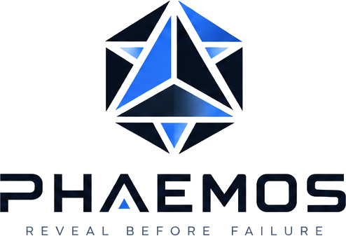

<h1 align="center">
  <picture>
    <source media="(prefers-color-scheme: dark)" srcset="assets/brand/phaemos-logo-dark.png">
    
  </picture>
</h1>

Reveal before failure. PHAEMOS is an open industrial IoT platform for predictive maintenance: sensor nodes stream what a machine is doing, a live dashboard shows it and a machine learning model flags the readings that drift from normal before they turn into a breakdown.

The name is pronounced FAY-mos and means "an ordered system that reveals", from Ancient Greek roots tied to revelation and structure.

> [!NOTE]
> The platform software runs end to end today: ingest, storage, anomaly scoring, alerts, tickets and the dashboard, with a simulator standing in for real machines. Wiring the physical nodes and training the model on real readings is the current phase. See the [milestones](https://github.com/phaemos/phaemos/milestones) for what is planned and in which order.

## What it does

- **Four sensor nodes.** An ESP32 gateway with 11 sensors, an STM32 running a vibration FFT at 100 Hz, an Arduino Nano and a Raspberry Pi Pico 2W cover temperature, vibration, current, gas, sound, distance and shaft speed.
- **Real-time pipeline.** A FastAPI backend ingests every reading into PostgreSQL and Redis and streams it to the dashboard over WebSocket.
- **Anomaly detection.** An Isolation Forest scores each reading as it arrives and raises an alert when a machine drifts. It needs no labelled fault data.
- **Operations built in.** Alert rules, maintenance windows, tickets, webhooks to Slack, Discord and Teams, email and SMS, tamper-evident audit logs and role-based access with two-factor sign-in.
- **Resilient at the edge.** A Rust gateway beside the machines reads a node's serial output, spools every reading to disk during a network outage and sends it on once the link returns, so nothing is lost.
- **Tools for developers.** A Python SDK, a simulator with injectable faults and a Go CLI for load testing.

## Architecture

```text
STM32 vibration node --UART-->  ESP32 gateway  --HTTPS POST, every 5 s-->  FastAPI backend
Arduino Nano -------serial-->   (11 sensors)                                 Isolation Forest scoring
Raspberry Pi Pico 2W ---------------HTTPS POST--------------------------->   alerts, tickets, webhooks
any node --serial--> Rust edge gateway (spools through outages) -------->        |
                                                                                 v
                                            PostgreSQL + Redis --WebSocket-->  Next.js dashboard
```

The full picture, from each node's sensors to the background tasks, is in [docs/architecture.md](docs/architecture.md), with the reasoning behind each choice in [docs/decisions.md](docs/decisions.md).

## Repository layout

This repository is the single source of truth. Each component folder is self-contained and is published to its own read-only repository on every merge to `main`, see [docs/repositories.md](docs/repositories.md).

| Folder | What it is | Published to |
| --- | --- | --- |
| [`backend/`](backend/) | FastAPI service: ingest, auth, alerts, tickets, webhooks and the Isolation Forest model | [`phaemos/backend`](https://github.com/phaemos/backend) |
| [`frontend/`](frontend/) | Next.js dashboard, admin panel and public pages | [`phaemos/frontend`](https://github.com/phaemos/frontend) |
| [`firmware/`](firmware/) | Code for the four nodes: ESP32, STM32, Arduino Nano and Pico 2W | [`phaemos/firmware`](https://github.com/phaemos/firmware) |
| [`hardware/`](hardware/) | Wiring tables, schematics, PCB layouts and the parts inventory | [`phaemos/hardware`](https://github.com/phaemos/hardware) |
| [`edge/`](edge/) | Rust store-and-forward gateway | [`phaemos/edge`](https://github.com/phaemos/edge) |
| [`client/`](client/) | Python SDK and simulator, plus a Go CLI | [`phaemos/client`](https://github.com/phaemos/client) |
| [`infra/`](infra/) | Docker Compose stack, Prometheus and Grafana, SQL reports | [`phaemos/infra`](https://github.com/phaemos/infra) |
| [`docs/`](docs/) | Architecture, API, deployment, security and decisions | stays here |
| [`assets/`](assets/) | Logos, colours and the social preview card | stays here |

## Quickstart

```bash
cp .env.example .env
make dev
```

The dashboard is then on `http://localhost:3000` and the API on `http://localhost:8000`, with interactive docs at `http://localhost:8000/docs`.

### Without hardware

```bash
pip install -e client/python
phaemos-sim --node esp32 --count 5 --dry-run
```

The simulator produces readings for any of the four node types and can inject faults such as a failing bearing, so the whole platform can be exercised on a laptop. Running without Docker, the API smoke test and the full test suite are covered in [docs/development.md](docs/development.md).

## Hardware

Four nodes are planned, each with its own role and sensors. The firmware and backend are ready, but the boards are still being wired and validated, so readings so far come from the simulator. The boards, their sensors and the wiring are in [hardware/README.md](hardware/README.md) and [docs/sensor_reference.md](docs/sensor_reference.md).

## Documentation

The docs live in [`docs/`](docs/) and build into a site with `make docs`. Start with [docs/index.md](docs/index.md). The tech stack is in [docs/tech-stack.md](docs/tech-stack.md), the release flow in [docs/releases.md](docs/releases.md) and the brand in [assets/brand/](assets/brand/).

## Licence

Software is licensed under the GNU Affero General Public License v3.0 or later, see [LICENSE](LICENSE). Hardware designs in `hardware/` are licensed under the CERN Open Hardware Licence v2, Strongly Reciprocal, see [hardware/LICENSE](hardware/LICENSE). [NOTICE.md](NOTICE.md) explains exactly which licence covers what.

## Contributing and support

See [CONTRIBUTING.md](CONTRIBUTING.md) to get involved and [GitHub Discussions](https://github.com/phaemos/phaemos/discussions) for questions and ideas. [SUPPORT.md](SUPPORT.md) lists every help channel and [SECURITY.md](SECURITY.md) explains how to report a vulnerability privately. For anything else, email [contact@phaemos.com](mailto:contact@phaemos.com).
