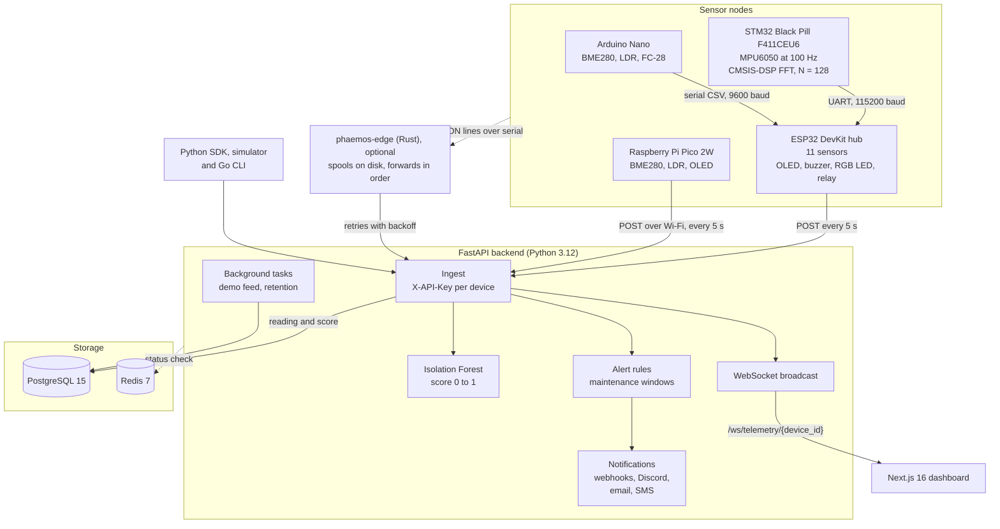
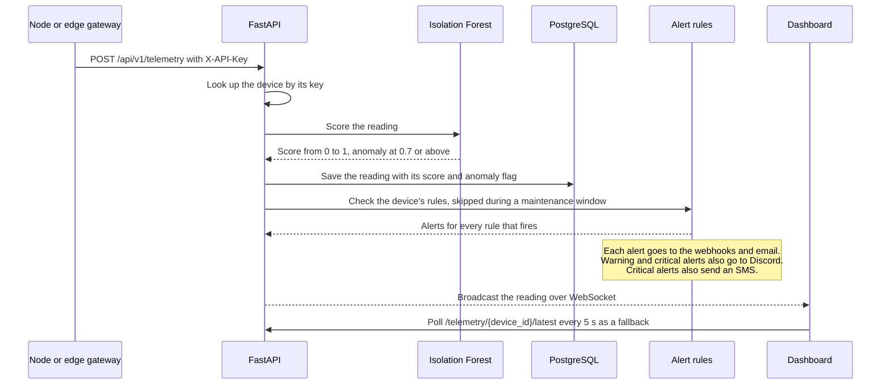
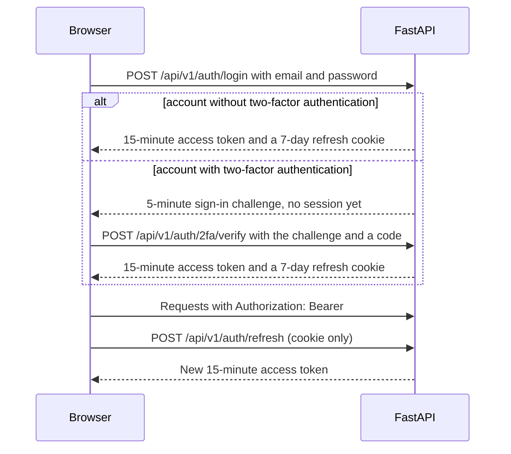
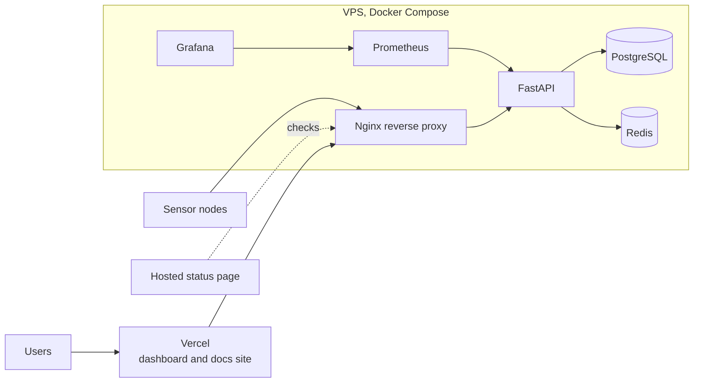

# Architecture Overview

PHAEMOS has five layers: sensor nodes on the machines, an optional edge gateway beside them, a FastAPI backend that scores and stores every reading, PostgreSQL for storage and a Next.js dashboard. The reasoning behind each choice is in [decisions.md](decisions.md).

## System diagram

The dashboard reads everything else through the REST API under `/api/v1`.

## Nodes and links

| Node | Board | Sensors and outputs | Link |
| --- | --- | --- | --- |
| Hub | ESP32 DevKit V1 | BME280, MPU6050, INA219, MLX90614, VL53L0X, MQ-2, AS5600, MAX4466, DS18B20, LDR, FC-28. Outputs: OLED, buzzer, WS2812B RGB LED, relay | Merges the other two nodes' data and posts JSON to the API every 5 s |
| Vibration | STM32 Black Pill F411CEU6 | MPU6050 sampled at 100 Hz, CMSIS-DSP `arm_rfft_fast_f32` FFT with N = 128 | UART to the hub at 115200 baud |
| Auxiliary | Arduino Nano | BME280, LDR, FC-28 | Serial CSV to the hub at 9600 baud |
| Ambient | Raspberry Pi Pico 2W | BME280, LDR, OLED | Posts JSON to the API over Wi-Fi every 5 s |

The Rust edge gateway is optional. It reads JSON lines on standard input (for example a node's serial port), appends each reading to a spool file and syncs it to disk, then forwards spooled readings in order. When the API is unreachable it keeps them and retries with backoff (1, 2, 4 seconds and so on, capped at one minute), so an outage or reboot loses nothing. Details are in [edge/README.md](https://github.com/phaemos/phaemos/blob/main/edge/README.md).

## Ingesting a reading

The model is loaded from `model.pkl` on first use. An admin can retrain it with `POST /api/v1/ml/retrain`, which has a one-hour cooldown. A sequence model for time-series prediction is planned for a later phase.

## Authentication

- **Token types:** access, refresh and sign-in challenge tokens each carry their purpose and are only accepted for it. The WebSocket accepts access tokens only.
- **Sessions:** every token carries the account's session version. Changing the password or turning two-factor authentication on or off raises it, which ends every other session while the current browser receives a fresh one.
- **Two-factor:** TOTP from an authenticator app, required at every sign-in once enrolled, including OAuth. Each code is accepted once. Enrolment cannot restart while two-factor authentication is on.
- **Lockout:** five failed attempts, wrong passwords and wrong codes alike, lock an account for 15 minutes. The lockout path runs even for unknown emails, so responses do not reveal which emails are registered.
- **OAuth:** Google and GitHub through `/api/v1/auth/{provider}` and `/api/v1/auth/{provider}/callback`. A random `state` ties each callback to the browser that started it. Only an email the provider reports as verified can sign in or link to an existing account. No token ever appears in a URL: the dashboard exchanges the refresh cookie for an access token. Apple sign-in is reserved and returns 501 until it is set up.
- **Invites:** an admin invites a user by email (sent through Resend) with one of the three roles, and the invite link creates the account.
- **Devices:** every node sends a per-device `X-API-Key`. A key is replaced with `POST /api/v1/devices/{device_id}/rotate-key` by an admin or the technician who manages the device.

## API surface

Every route below sits under `/api/v1`. The interactive reference is at `/docs` on a running API and the full list is in [api-reference.md](api-reference.md).

| Group | Routes | Purpose |
| --- | --- | --- |
| Telemetry | `/telemetry`, `/telemetry/{device_id}`, `/telemetry/{device_id}/latest`, `/telemetry/export` | Ingest, history, latest reading and CSV export |
| Devices | `/devices`, `/devices/{device_id}`, `/rotate-key`, `/tags`, `/devices/batch/firmware-update` | Registry, API keys, tags and batch firmware updates |
| Alerts | `/alerts`, `/alerts/{alert_id}/resolve`, `/alert-rules` | Alert history and threshold rules per device and metric |
| Tickets | `/tickets`, `/tickets/{ticket_id}` | Maintenance tickets with `PHM-0001` style numbers |
| Maintenance | `/maintenance-windows` | Planned downtime that pauses alerting |
| Machine learning | `/ml/score`, `/ml/retrain`, `/ml/anomalies/{device_id}` | Scoring, retraining and anomaly history |
| Firmware | `/firmware/upload`, `/firmware/latest`, `/firmware/download` | Over-the-air updates for the ESP32 hub |
| Auth | `/auth/...` | Sign-in, tokens, profile, two-factor, OAuth, invites, data export and account deletion |
| Admin | `/auth/users`, `/audit-logs`, `/audit-logs/export`, `/webhooks`, `/demo/start`, `/demo/stop` | Users and permissions, the audit log, webhook destinations and the demo feed |
| Fleet | `/health/summary` | Fleet health summary for the dashboard |
| Public | `/contact` | Contact form with Cloudflare Turnstile |

Outside `/api/v1`, `GET /` answers liveness checks and `GET /status` reports `operational` or `degraded` from database and Redis checks. The WebSocket lives at `/ws/telemetry/{device_id}`.

## Storage

- **PostgreSQL 15** holds devices, telemetry, alerts, rules, tickets, users, webhooks, maintenance windows and the audit log. The schema is built from the ten SQL files in `backend/migrations/` (001 to 010).
- **Redis 7** runs in the Compose stack and is part of the `/status` check. WebSocket fan-out and rate limits currently live inside the API process, so a deployment with several API workers would move both onto Redis.

## Dashboard

| Area | Pages |
| --- | --- |
| Operations | `/` live dashboard, `/devices`, `/devices/[id]`, `/alerts`, `/tickets`, `/compare` (up to three devices side by side) |
| Admin | `/admin`: users, alert rules, OTA firmware, audit log, webhooks and maintenance windows |
| Account | `/login`, `/profile` (details, two-factor, data export and deletion) |
| Public | `/about`, `/blog`, `/blog/[slug]`, `/changelog`, `/docs`, `/status`, `/security`, `/faq`, `/support`, `/contact`, `/privacy`, `/terms` |

## Background tasks

Two APScheduler `BackgroundScheduler` instances run in daemon threads inside the API process.

| Task | Schedule | What it does |
| --- | --- | --- |
| Demo telemetry | Every 5 s while running | Generates sinusoidal readings for the demo node after `POST /demo/start` |
| Data retention | Daily at 02:00 UTC | Deletes telemetry older than 90 days and records the row count in the audit log |

Both tasks open their own SQLAlchemy sessions rather than the request-scoped `Depends(get_db)`, so no session is shared across threads.

## Notifications

Every alert a rule raises goes to each enabled webhook (Slack incoming webhooks, Discord webhook URLs or Microsoft Teams connector cards) and by email over SMTP to the configured alert address. Warning and critical alerts also post to the project's Discord channel. A webhook can carry an optional template rendered with the alert's device, metric, value, threshold and severity. Critical alerts also send an SMS through Brevo to the device owner's phone number. Each channel is a no-op until its credentials are configured.

## Deployment

**Current state:** the backend's `Deploy` workflow (`.github/workflows/deploy.yml`) still posts to a Render deploy hook after CI passes on `main`. That workflow is disabled and no backend is deployed automatically today. At the Launch milestone the backend moves to the VPS layout below ([decision 015](decisions.md)) and the workflow is updated to match.

The target layout for the Launch milestone:

| Service | Platform | Notes |
| --- | --- | --- |
| Dashboard | Vercel | Deploys from `main` |
| Docs site | Vercel | MkDocs Material build |
| API, PostgreSQL and Redis | VPS | Docker Compose behind an Nginx reverse proxy |
| Observability | Prometheus and Grafana | Compose overlay on the VPS |
| Status page | Hosted service | Runs off the VPS so it survives a VPS outage |

Setup steps are in [deployment.md](deployment.md).

## Security boundaries

- **Devices:** `X-API-Key` on every telemetry ingest.
- **Users:** a 15-minute JWT bearer token on every protected route, refreshed from a 7-day httpOnly cookie scoped to the refresh path.
- **Roles:** `admin`, `technician` or `viewer` (the default) checked on every protected endpoint, with per-user permission overrides stored as JSONB. Admins manage every device, technicians manage their own or unassigned devices and viewers are read-only.
- **Passwords:** bcrypt through passlib.
- **Rate limits:** per IP with slowapi, for example sign-in at 5 a minute, registration at 10 an hour and the contact form at 3 an hour. The client IP comes from Nginx's `X-Real-IP` header, which is only trusted when the request arrives from an address in `TRUSTED_PROXIES`.
- **Queries:** the ORM handles almost every query. The few raw SQL statements (the audit log and the retention task) use bound parameters, so input never becomes SQL.

## Licence

Software is released under the [GNU Affero General Public License v3](https://github.com/phaemos/phaemos/blob/main/LICENSE) or later and the hardware designs under the [CERN Open Hardware Licence v2, Strongly Reciprocal](https://github.com/phaemos/phaemos/blob/main/hardware/LICENSE). [NOTICE.md](https://github.com/phaemos/phaemos/blob/main/NOTICE.md) explains which licence covers what.
